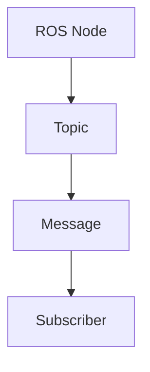

# Quickstart Guide: Physical AI & Humanoid Robotics Course

## Prerequisites

Before starting with the Physical AI & Humanoid Robotics course setup, ensure you have the following installed:

- **Node.js**: Version 18 or higher
- **npm**: Version 8 or higher (usually comes with Node.js)
- **Git**: For version control

## Getting Started

### 1. Clone the Repository

```bash
git clone <repository-url>
cd <repository-name>
```

### 2. Install Dependencies

```bash
npm install
```

This will install Docusaurus and all necessary dependencies for the course.

### 3. Start Development Server

```bash
npm start
```

This command starts a local development server and opens the course in your default browser. Most changes are reflected live without restarting the server.

## Course Structure

The course content is organized as follows:

```
docs/
├── intro/                    # Introduction content
├── modules/                  # 4 main modules
├── weeks/                    # 13 weeks of content (4 chapters each)
├── assessments/              # All assessments and quizzes
├── hardware/                 # Hardware requirements and guides
├── lab-options/              # On-premise and cloud lab setup
└── appendix/                 # Additional resources
```

## Adding New Content

### Creating a New Chapter

To create a new chapter:

1. Create a new `.md` or `.mdx` file in the appropriate week directory
2. Add frontmatter with metadata:

```markdown
---
title: Chapter Title
description: Brief description of the chapter
sidebar_label: Chapter Title
---

# Chapter Title

Your content here...
```

### Creating a New Week

1. Create a new directory in `docs/weeks/` (e.g., `week-14/`)
2. Add an `index.md` file for the week overview
3. Add 4 chapter files with appropriate naming convention

## Content Guidelines

### Rich Content

You can include:

- **Code blocks**: Use triple backticks with language specification
- **Mermaid diagrams**: Use mermaid code blocks for diagrams
- **Tables**: For hardware comparisons and other data
- **Admonitions**: For important notes, warnings, and tips

### Example Content Elements

#### Code Block
```python
def hello_robot():
    print("Hello, Physical AI World!")
```

#### Mermaid Diagram


#### Admonition
```markdown
:::note
This is an important note for students.
:::

:::tip
This is a helpful tip.
:::

:::caution
This is a warning about potential issues.
:::
```

## Building for Production

To build the static site for deployment:

```bash
npm run build
```

The built site will be in the `build/` directory and can be deployed to any static hosting service.

## Deployment

The course is configured for automatic deployment to GitHub Pages via GitHub Actions. When you push changes to the main branch, the workflow will automatically build and deploy the site.

To manually trigger a deployment:

1. Commit and push your changes
2. The GitHub Actions workflow will automatically build and deploy

## Troubleshooting

### Common Issues

**Issue**: Page doesn't update after changes
**Solution**: Clear browser cache or do a hard refresh (Ctrl+F5)

**Issue**: Images or diagrams not showing
**Solution**: Check file paths are correct and files exist in the expected location

**Issue**: Build fails
**Solution**: Check for syntax errors in MDX files, especially in frontmatter

## Next Steps

1. Explore the existing content in the `docs/` directory
2. Customize the `docusaurus.config.js` file to match your branding
3. Add your own content following the established patterns
4. Test the course locally before deploying
5. Review the deployment workflow to ensure it matches your needs